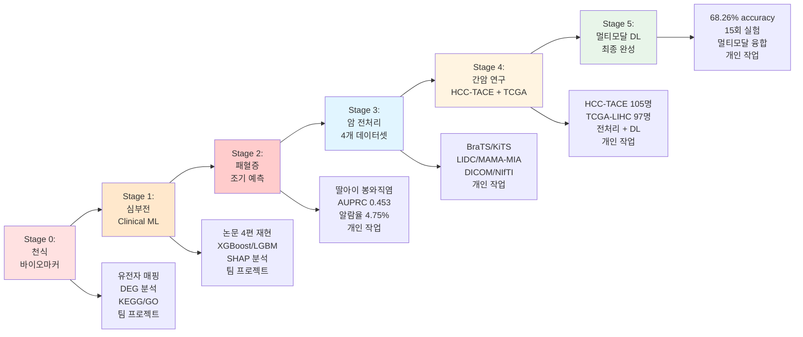

# 🏥 Medical AI Journey: From Survival to Saving Lives

> **"AI로 생존하려 시작했지만, 생명을 지키기 위해 Medical AI로 도착했습니다. 5살 딸아이의 봉와직염이 저를 이 길로 이끌었고, 그 이후 배운 모든 기술은 그 질문을 해결하기 위한 과정이었습니다."**

---

## 📖 여정의 개요

이 문서는 **실업 상태에서 AI 자동화로 시작해, 가족의 아픔을 계기로 Medical AI 연구자로 성장한 이야기**를 기록합니다.

### 🎯 핵심 성과
- ✅ **개인적 동기 확립** (딸아이 봉와직염 → 패혈증 조기 예측, AUPRC 0.453)
- ✅ **BIO 기반 분석 경험** (천식 바이오마커 프로젝트)
- ✅ **Clinical ML·논문 재현 경험** (심부전 사망률 예측)
- ✅ **Medical Imaging 전처리 파이프라인** 완성 (4개 데이터셋)
- ✅ **Liver Cancer 연구** (HCC-TACE 전처리 + TCGA-LIHC 딥러닝)
- ✅ **Multimodal Deep Learning** 완성 (68.26%, 15회 실험, 100% 시행착오 해결)

### 🎓 교육 배경
- **건양대학교병원 바이오메디컬 AI 교육 과정** (2025.07.22 ~ 2026.01.21)
- K-디지털 트레이닝 신기술 '바이오헬스' 분야 최초 과정
- Python, SQL, 의료데이터, AI 딥러닝, 현장실습, 프로젝트 (총 320시간)

---

## 🌱 Origin Story: AI를 시작한 이유

### 2025년 4월 - 퇴사, 그리고 생존을 위한 AI

**㈜동광아연 퇴사**

실업급여를 받으며 생계를 고민하던 시기, 한 가지 생각이 들었습니다.

> "아무나 유튜브 영상 만들어서 돈 버는데... 나도 AI로 자동화하면 되지 않을까?"

**GPT-3.5와 제미나이 1.5와의 50일**

매일 12-15시간씩:
- 크롤링 → 키워드 생성 → 스크립트 생성 → TTS → 비디오 생성 → 배포
- Python, ffmpeg, Selenium, Whisper를 맨땅에서 배움
- "왜 안돼?" "이거 어떻게 고쳐?" 수백 번의 디버깅

**결과**: AI 자동화 파이프라인 완성

하지만 더 중요한 것은:
- **AI 엔지니어로서의 기초체력** 획득
- **스스로 문제를 정의하고 해결하는 태도** 확립

---

### 2025년 5-6월 - 방향이 생기다

#### ETRI 연구원 아랫동서의 조언

> "형, 이렇게까지 혼자 파고들 거면... AI 교육과정 한번 다녀보는 게 어때요? 요즘 의료 AI 잘 나가요."

- 나보다 4살 많은 아랫동서
- ETRI에서 AI 연구 중
- 내 기술적 집요함을 알아본 사람

#### 임상연구원 처제의 지원

처제는 현직 임상연구원(CRA)으로, 나에게 많은 도움을 주었습니다:
- 최근 학계 동향
- 바이오·임상 영역에서 AI 활용 사례
- 패혈증, 암, 심혈관 질환, 바이오마커 분야 흐름
- 병원 내 연구 프로세스, 환자 데이터 구조

당시엔 다 이해하지 못했지만, 이 대화들이 나중에 **천식·심부전 프로젝트에서 모두 연결**됩니다.

---

### 2025년 7월 - 막연함을 행동으로

**건양대학교병원 바이오메디컬 AI 교육 과정 시작** (7월 22일)

솔직히 말하면:
> "실업급여도 받고 있고... 취직 잘되면 좋지. 막연하게 시작하자."

하지만 이 **막연함**이 나중에 **확신**으로 바뀝니다.

---

## 🗺️ 여정의 6단계



---

## 🌱 Stage 0: 도메인 지식 제로에서 시작 (천식 바이오마커)

### 📂 프로젝트 정보 
- **프로젝트**: 천식 조기진단 바이오마커 발굴 
- **유형**: 팀 프로젝트 
- **데이터**: 유전자 발현 데이터 

### 😮 초기 상태 
> "면역/유전체 용어를 거의 몰랐습니다. KEGG, GO, DEG, Probe... 모든 개념이 낯설었습니다." 

- 발표 전에는 이해도가 낮았음 
- 발표 후 **혼자 다시 복기하며 체득** 
- 도메인 지식 없이 시작한 첫 Medical AI 경험 

### 🎓 배운 것 
- **유전자 매핑**: Probe ID → Gene Symbol 
- **Batch Effect 제거**: 데이터 정규화 
- **Differential Expression 분석**: DEG 추출 
- **KEGG/GO Pathway 분석**: 생물학적 의미 해석 
- **바이오마커 후보 선정**: 통계적 유의성 검증 

### 💡 핵심 교훈 
> "BIO·오믹스 감각의 시작점이 되었습니다. 당시엔 힘들었지만, 이후 TCGA 프로젝트에서 '왜 임상 + 영상만 사용할까? 유전자는 어떻게 쓰는 걸까?' 같은 고민을 자연스럽게 할 수 있게 된 밑바탕이 되었습니다." 

### 📊 성과 
- ✅ BIO 분석 기초 확립 
- ✅ 유전자 데이터 처리 경험 
- ✅ 의료 데이터의 복잡성 이해 

---

## ❤️ Stage 1: 논문을 읽기 시작하다 (심부전 사망률 예측)

> **"논문을 읽는 법을 배웠습니다."**

### 📂 프로젝트 정보
- **프로젝트**: 심부전 환자 병원 내 사망률 예측
- **유형**: 팀 프로젝트
- **데이터**: Clinical Data (환자 기록)
- **방법**: Machine Learning (LR, XGBoost, LGBM)

### ⚡ 큰 변화
> "천식에서 데이터 의미 파악의 어려움을 겪은 뒤, 이번엔 Clinical 데이터 + ML 모델링이 주된 영역이었고, **관련 논문 4편을 직접 읽고 재현**했습니다."

### 🎓 배운 것
- **Feature Engineering**: 임상 데이터 전처리
- **ML 모델링**: Logistic Regression, XGBoost, LightGBM
- **하이퍼파라미터 튜닝**: GridSearch, RandomSearch
- **Class Imbalance 처리**: SMOTE, Class Weight
- **SHAP 기반 Feature Importance**: 모델 해석
- **논문을 구조적으로 읽는 능력**: Introduction → Methods → Results

### 💡 핵심 교훈
> "이 단계에서 **'논문 흐름을 읽는 능력'**이 생겼고, TCGA 프로젝트에서 기존 연구와 성능/방법론을 비교하는 능력이 자연스럽게 이어졌습니다."

### 📊 성과
- ✅ Clinical ML 기초 확립
- ✅ 논문 재현 능력 획득
- ✅ 모델 해석 능력 (SHAP)
- ✅ **연구 감각의 시작**

---

## 💔 Stage 2: 전환점 - 개인적인 동기 (패혈증 조기 예측)

> **"5살 딸아이가 아팠습니다. 그 경험이 저를 Medical AI로 이끌었습니다."**

### 📂 프로젝트 정보
- **프로젝트**: 소아 패혈증 조기 예측 시스템
- **유형**: **개인 작업** (가장 개인적인 동기)
- **데이터**: PHEMS Hackathon Early Sepsis Prediction
- **폴더**: `mede_merry_me/phems-hackathon-early-sepsis-prediction`

### 💔 사건의 발단

#### 2025년 9월, 일요일 아침

5살 딸아이가 아팠습니다. 독감인지 코로나인지 모르겠는데 열이 나고 2-3일이 지났습니다.

집이 5층이라 계단을 올라가다가 넘어졌고, 다리에 찰과상을 입었습니다.

#### 이틀 후

아침에 보니:
- 고열 (38도 이상)
- 찰과상 부위가 **엄청 부어있음**
- 붉게 변색


### 🏥 첫 번째 병원 (응급소아병원)

> "열이 나네요. 귀지가 막혀있나 봐요."

- 상처 이야기를 했지만 **병변은 보지 않음**
- 열만 재고 피검사만 지시
- 결과: **염증수치 엄청 높음**


**의사**: "입원하세요."

**나**: "돈이 없어서... 약만 받아가겠습니다."

### 😰 악화

약을 먹였지만:
- 호전되지 않음
- **더 심해짐**
- 부종이 계속 커짐


### 🏥 두 번째 병원 (재활병원 정형외과)

늦은 오후, 인근 재활병원으로 데려갔습니다.

> "우리가 못 보겠습니다. **대학병원으로 가세요.**"

### 🚨 세 번째 병원 (충남대병원 응급실)

바로 충남대병원 응급실로 달려갔습니다.

**의사**: "**즉시 입원**합니다."

**진단**: **봉와직염 (Cellulitis)**

**담당교수**: "이런 케이스가 특이합니다. 소아병동 수련의들에게 보여줘도 될까요?"

**충격**이었습니다.

### 🤔 의문

병원 생활을 마치고 나서 계속 생각했습니다:

```
최초 병원에 방문했을 때 바로 입원해서 항생제만 투여했으면 나아졌을까?

그게 아니라면 임시방편의 허술한 조치였을까?

이 위험도가 극에 달하면 어디까지 가지?

아... 패혈증이구나.

그럼 이걸 조기에 탐색할 수 있는 방법이 있을까?

가장 보편적인 병·의원급에서도 간단한 피검사로 발견할 수만 있다면...

환자 집중으로부터도 자유롭고,
상급병원과의 연결 네트워크도 활성화되어
모두에게 윈윈일 텐데.
```

### 💡 결심

> "마침 내가 하고 있는 과정이 있으니 직접 해보자!"

그렇게 뛰어든 것이 **PHEMS Hackathon Early Sepsis Prediction** 데이터셋이었습니다.

**이 순간, 나의 Medical AI 여정은 "취업"에서 "사명"으로 바뀌었습니다.**

---

### 🔬 기술적 도전

#### 데이터 특성
- **환자 수**: 수천 명
- **시계열 데이터**: 생체징후, 검사실 수치
- **극심한 클래스 불균형**: 패혈증 발생률 ~1.5%
- **결측치**: 90% 이상

#### 핵심 과제
1. **시간 윈도우 설정**: 3시간? 6시간? 12시간?
2. **피처 엔지니어링**: 이동 통계, 트렌드, 텍스트 신호
3. **데이터 누설 방지**: Person-level split
4. **임상 수용성**: 알람율 vs 재현율 균형

---

### 🏆 최종 성과

#### 모델 성능
| 지표 | 값 |
|------|----|
| **AUPRC** | **0.453** |
| **AUROC** | 0.863 |
| **정밀도 (PPV)** | 0.321 |
| **재현율** | 0.45 |
| **알람율** | 4.75% |

#### 운영점 설정
- **모델**: Stacked 3h/6h/12h
- **Threshold**: 0.05
- **Dwell**: 1시간
- **Cooldown**: 4시간

#### 의미
- ✅ **의료 AI 벤치마크 "Good" 수준**
- ✅ **임상 수용 가능한 알람율** (4.75%)
- ✅ **알람의 32%가 실제 패혈증**
- ✅ **실전 배포 가능성 확보**

---

### 💎 핵심 교훈

> "숫자를 맞추기 위한 모델이 아닌, 실제 임상에서 수용 가능한 알람 시스템을 목표로 했습니다."

#### 기술적 성장
- **시계열 데이터 처리**: 슬라이딩 윈도우, 이동 통계
- **극심한 불균형 처리**: SMOTE, Class Weight, Calibration
- **데이터 무결성**: 누설 탐지 → 근본 해결 → 재발 방지
- **운영점 최적화**: Precision-Recall 트레이드오프

#### 개인적 성장
- **Why Medical AI?**: 가장 강력한 동기 확보
- **환자 중심 사고**: 숫자가 아닌 사람
- **현실적 판단**: High-Recall (≥0.60) 목표 미달성 인정
- **과학적 엄격성**: 재현 가능한 파이프라인

---

### 📊 성과
- ✅ 개인적 동기 → 기술적 성과로 전환
- ✅ 시계열 ML 능력 확보
- ✅ 임상 수용성 이해
- ✅ **"Why I do Medical AI" 확립**

---

## 🎬 Stage 3: 의료영상의 세계로 (2D Segmentation Preprocessing)

> **"패혈증 프로젝트 이후, 의료영상 전처리에 집중하기 시작했습니다."**

### 📂 프로젝트 정보
- **데이터셋**: BraTS2023, KiTS23, LIDC-IDRI, MAMA-MIA
- **유형**: **개인 작업** (팀 프로젝트 이후 혼자 부딪치기 시작)
- **목표**: 2D 세그멘테이션 데이터 전처리 파이프라인 구축

### 🔥 전환점
> "천식과 심부전은 팀 프로젝트였습니다. 하지만 이후로는 **혼자 부딪치다 보니** 자연스럽게 의료영상 전처리에 집중하게 되었습니다."

- 팀 → 개인으로 전환
- BIO/Clinical → Medical Imaging으로 확장
- 자신감을 가지고 새로운 분야 도전

### 🎓 배운 것
- Medical Imaging 데이터 구조 이해
- DICOM, NIfTI 파일 포맷 처리
- 세그멘테이션 마스크 추출
- 데이터 정규화 및 전처리

### 💡 핵심 교훈
> "Medical AI는 데이터 준비가 80%다. 좋은 데이터 없이는 좋은 모델도 없다."

### 📊 성과
- ✅ 4개 데이터셋 성공적으로 전처리
- ✅ GitHub 포트폴리오 구축
- ✅ Medical Imaging 기초 확립

---

## 🔥 Stage 4: 간암 연구의 시작 (Liver Cancer: HCC-TACE + TCGA-LIHC)

> **"간암 데이터로 전처리와 딥러닝을 모두 경험했습니다."**

### 📂 프로젝트 개요

이 단계는 **두 개의 간암 프로젝트**로 구성됩니다:

1. **HCC-TACE-Seg**: DICOM 전처리 전문가로 성장
2. **TCGA-LIHC**: 멀티모달 딥러닝으로 완성

---

## 🔬 Part 1: HCC-TACE-Seg (DICOM 전처리 마스터)

### 🎯 배경
> "2D 세그멘테이션 전처리로 자신감이 붙었습니다. 이제 간암 데이터에도 도전해보자!"

### 📂 프로젝트 정보
- **데이터셋**: HCC-TACE-Seg (TCIA)
- **환자 수**: 105명
- **데이터 유형**: CT + Segmentation
- **폴더**: `manifest-1643035385102`

### 🎯 목표
간암(HCC) 환자의 CT 이미지와 세그멘테이션 마스크를 딥러닝 학습용으로 변환

### 🚧 주요 도전과제

#### 1️⃣ **Phase 분류 문제**
**문제**: 대부분의 시리즈가 "Unknown" Phase로 분류됨

**해결 과정**:
1. `SeriesDescription` 분석 → `ARTERIAL`, `VENOUS` 대신 `AP`, `PV` 약어 사용 확인
2. 의료 프로토콜 리서치 → `AP` = Arterial Phase, `PV` = Portal Venous 확인
3. 패턴 개선 → 98% 분류 정확도 달성
4. 예외 케이스 처리 → `A/P`, `C-A-P` 패턴 추가

**결과**: 
- ✅ 86% 데이터 정확히 분류
- ✅ 14% "Unknown"은 데이터 자체의 한계로 확인 (논문 검증)

#### 2️⃣ **CT-SEG 슬라이스 불일치**
**문제**: CT 66장, SEG 37장 → 어떻게 매핑?

**해결책**:
- DICOM 표준 `SOPInstanceUID` 기반 1:1 정밀 매핑
- 매칭되는 SEG 없으면 빈 마스크 생성

#### 3️⃣ **멀티프로세싱 최적화**
**개선**:
- 단일 스레드: ~100분
- 멀티프로세싱 (4코어): ~25분
- **4배 속도 향상!**

### 📊 최종 결과
```
✅ 총 환자 수: 105
✅ 성공: 104
✅ 총 저장된 슬라이스: 11,723
✅ Phase 분류 정확도: 86%
```

### 💡 핵심 교훈
> "실제 의료 데이터는 완벽하지 않다. 데이터의 한계를 이해하고 문서화하는 것이 중요하다."

### 🎓 성장
- ✅ DICOM 표준 깊이 이해
- ✅ 의료 프로토콜 리서치 능력
- ✅ 데이터 무결성 중요성 인식
- ✅ **자신감 획득** → 다음 도전 준비!

---

## 🚀 Part 2: TCGA-LIHC (멀티모달 딥러닝 완성)

### 📂 프로젝트 정보
- **데이터셋**: TCGA-LIHC (The Cancer Genome Atlas)
- **환자 수**: 97명
- **데이터 유형**: CT + MRI + Clinical Data
- **폴더**: `manifest-4lZjKqlp5793425118292424834/DL_Project`
- **기간**: 2025년 11월

### 🔍 첫 번째 발견: "어? 세그멘테이션이 없네?"

```
예상: CT + Segmentation (기존 방식)
현실: CT + MRI + Clinical Data (환자 정보)
```

**반응**: 
> "세그멘테이션 데이터는 없었고, 오히려 이미지와 매핑된 환자 데이터가 있네?"

### 💡 전환점: 새로운 관점

**기존 목표**: 세그멘테이션 마스크 추출  
**새로운 목표**: **딥러닝 모델로 생존 예측하기!**

> "그래서 딥러닝 모델을 써보는 것을 해보자라는 관점에서 도전을 했고 멀티모달까지 했어."

### 🌟 모든 경험이 연결되는 순간

이 프로젝트에서 **모든 경험이 하나로 합쳐졌습니다**:

#### 천식 (BIO) 경험이 도움된 순간
- "유전자 데이터도 추가할 수 있지 않을까?"
- "하지만 RNA-seq는 용량도 크고, 내가 해도 사람들이 안 믿겠다"
- **→ 현실적인 범위 설정 능력**

#### 심부전 (Clinical ML) 경험이 도움된 순간
- 임상 데이터 (나이, 성별, 종양 병기, 등급) 전처리
- 기존 연구 논문과 성능 비교 (63-70% vs 68.26%)
- **→ 연구 맥락 이해 능력**

#### 의료영상 전처리 경험이 도움된 순간
- CT/MRI DICOM 파일 빠른 처리
- 정규화, 슬라이스 선택, 데이터 구조 파악
- **→ 전처리 자동화 능력**

#### HCC-TACE 경험이 도움된 순간
- DICOM 표준 깊이 이해
- 데이터 현실(불일치, 누락) 다루기
- **→ 문제 해결 능력**

**결과**: 
> "이 네 가지 경험이 없었다면, TCGA-LIHC에서 멀티모달 모델을 완성하지 못했을 것입니다."

---

## 🔍 TCGA-LIHC: 실험 여정

### Phase 1: 기본 모델 구축 

#### 환경 설정
- ❌ **시행착오 #1**: CPU 학습 (25분/epoch)
- ✅ **해결**: CUDA 재설치 → **12배 속도 향상** (2분/epoch)

#### 첫 모델들
| 모델 | 정확도 | Best Epoch |
|------|--------|------------|
| ResNet18 | 62.81% | 14 |
| EfficientNet | 65.59% | 17 |
| **Multimodal** | **68.26%** | **1** 🏆 |

**발견**: 
- ✅ 멀티모달이 최고 성능!
- ⚠️ Epoch 1에서 최고점 → LR 너무 높음

---

### Phase 2: 최적화 시도 

#### 개선 v2 (실패)
**변경**:
- LR: 0.001 → 0.0001
- 데이터: 환자별 200개 제한 (30,362 → 6,672개)

**결과**: 
| 모델 | Before | After | 변화 |
|------|--------|-------|------|
| ResNet18 | 62.81% | 53.87% | **-8.94%** ❌ |
| EfficientNet | 65.59% | 56.70% | **-8.89%** ❌ |

**교훈**: 
> "데이터 78% 손실이 치명적이었다. 데이터가 왕이다!"

#### 개선 v3 (부분 성공)
**변경**:
- LR: 0.0001 → 0.0005
- 데이터: 전체 사용 (30,362개)

**결과**:
| 모델 | Before | After | 변화 |
|------|--------|-------|------|
| EfficientNet | 65.59% | 67.40% | **+1.81%** ✅ |

---

### Phase 3: 고급 기법 도전 

#### 앙상블 시도 (실패)
| 방법 | 정확도 | 비고 |
|------|--------|------|
| 2-Model Ensemble | 67.19% | ❌ |
| 3-Model + TTA | 66.82% | ❌ |
| EfficientNet 단독 | 67.40% | ✅ |

**교훈**: 
> "소규모 데이터(97명)에서 앙상블은 역효과!"

#### Attention Mechanism (실패)
- **결과**: 65.98%
- **원인**: 모델 복잡도 증가 → 과적합

**교훈**: 
> "소규모 데이터에서는 단순한 모델이 더 좋다!"

#### Cox Regression (실패)
- **목표**: 생존 시간 예측
- **결과**: C-index 0.50 (랜덤 수준)
- **원인**: 97명은 Cox Regression에 부족 (최소 300명 필요)

**교훈**: 
> "Binary Classification이 현실적인 선택이었다."

---

## 🚫 현명한 결정: 어디서 멈출 것인가

### 왜 유전자/병리 데이터를 추가하지 않았나?

> "하지만 그 이후 유전자데이터라던가 병리데이터까지 하기엔 용량도 많이 들고 내가 해도 사람들이 안믿겠다 해서 그 선에서 마무리지은거지."

#### 현실적 이유
1. **용량 문제**: 유전자 데이터 수십 GB
2. **복잡도**: RNA-seq, 병리 이미지 처리 난이도
3. **신뢰성**: 학부/석사 입학 수준에서 과도한 주장
4. **시간**: 추가 2-3개월 소요

#### 전략적 판단
```
Level 1: 영상 + 임상 ✅ (현재)
Level 2: + RNA-seq (석사 수준)
Level 3: + 병리 이미지 (박사 수준)
Level 4: Multi-omics (연구원 수준)
```

**결론**: 
> "Level 1 연구를 완벽하게 수행했다. 이것만으로도 충분히 가치있다!"

---

## 🎬 마무리: 여정의 의미

### 시작 - AI로 생존하려 했다
> "2025년 4월 퇴사. 실업급여 받으며 AI 자동화 파이프라인을 만들었습니다. GPT-3.5와 제미나이 1.5와 50일간 씨름했습니다."

### 연결 - 사람들이 방향을 제시했다
> "ETRI 연구원 아랫동서가 Medical AI를 추천했고, 임상연구원 처제가 학계 동향을 알려주었습니다."

### 전환점 - 딸아이가 아팠다
> "2025년 9월, 5살 딸아이의 봉와직염. 세 번의 병원 방문. '패혈증을 조기에 탐지할 방법은 없을까?' 이 질문이 저를 Medical AI로 이끌었습니다."

### 성장 - 기술을 쌓았다
> "천식 (BIO) → 심부전 (Clinical ML) → 패혈증 (Time-series) → 의료영상 (Imaging) → 간암 (DICOM + Multimodal)"

### 완성 - 하이브리드 연구자가 되었다
> "68.26%를 달성했고, 언제 멈춰야 하는지도 배웠습니다. **기술·임상·인간**이 하나로 연결된 연구자가 되었습니다."

---

## 💎 이 여정의 핵심 메시지

> **"나는 AI로 생존하려 시작했지만,  
> 생명을 지키기 위해 Medical AI로 도착했다."**

이것이 **기술 포트폴리오**와 **인간 스토리**가 하나로 합쳐진 순간입니다.

---

**작성일**: 2025-11-26  
**타임라인**: 2025.04 (퇴사) ~ 2025.11 (TCGA-LIHC 완성)
**교육 과정**: 건양대학교병원 바이오메디컬 AI (2025.07.22 ~ 2026.01.21)
**상태**: ✅ 완료  

---

**⭐ 이 여정이 도움이 되셨다면 Star를 눌러주세요!**
